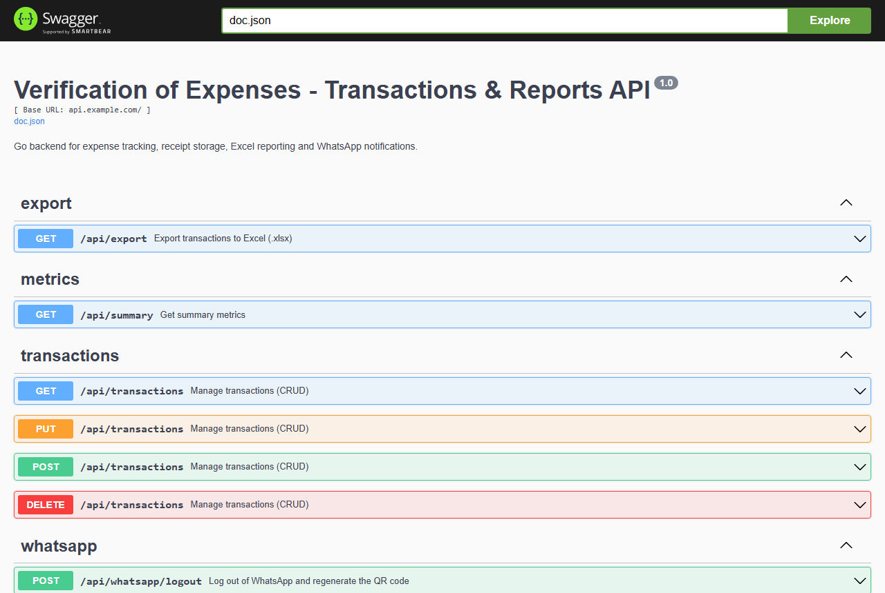
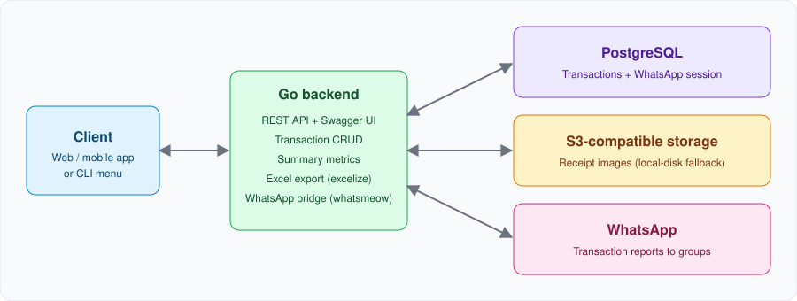

# Verification of Expenses

**A Go backend that turns expense tracking into a closed loop: record a transaction with its receipt, get summary metrics, export an Excel report, and push the transaction to a WhatsApp group - all from one REST API.**


> All data and configuration in this repository is dummy/placeholder. Bring your own credentials through environment variables (see `.env.example`).



## What it does

| Step | Capability |
| --- | --- |
| **Record** | Create, list, search, edit and delete transactions (date, description, amount, city, bank, reference) via REST or an interactive CLI menu |
| **Attach** | Upload a receipt image per transaction, stored in any S3-compatible bucket (Cloudflare R2, AWS S3, Backblaze B2, Neon) with a local-disk fallback |
| **Measure** | `GET /api/summary` returns the overall total, the current month's total and the transaction count |
| **Report** | `GET /api/export` downloads the ledger as an Excel workbook |
| **Notify** | Send any transaction to a WhatsApp group or contact; concurrent duplicate sends are prevented |

## Architecture



- `main.go` - startup, environment loading (fails fast without `DATABASE_URL`), interactive CLI
- `internal/api` - HTTP handlers, CORS, Swagger UI (`/docs/`)
- `internal/db` - PostgreSQL access and schema bootstrap
- `internal/storage` - S3-compatible / local receipt storage
- `internal/whatsapp` - WhatsApp multi-device client (pairing QR, group lookup, sending)
- `internal/export` - Excel report generation
- `cmd/dbmigrate`, `cmd/warecover` - maintenance tools (copy data between databases, recover receipts from a WhatsApp chat export)

## API

| Method | Endpoint | Description |
| --- | --- | --- |
| `GET` `POST` `PUT` `DELETE` | `/api/transactions` | Transaction CRUD (JSON or multipart with receipt file) |
| `GET` | `/api/summary` | Totals and counts |
| `GET` | `/api/export` | Excel export |
| `POST` | `/api/whatsapp/send` | Send a transaction to WhatsApp |
| `GET` | `/api/whatsapp/status` | Connection state, pairing QR, joined groups |
| `POST` | `/api/whatsapp/logout` | Unlink the device and regenerate the QR |
| `GET` | `/docs/` | Interactive Swagger UI |

Try it:

```bash
curl -X POST http://localhost:8080/api/transactions \
  -H "Content-Type: application/json" \
  -d '{"fecha_pago":"02/09/2026","descripcion":"Office supplies","monto":184.5,"ciudad":"Springfield","banco_usado":"Demo Bank","referencia":"REF-100234"}'

curl http://localhost:8080/api/summary
```

## Quick start

Requirements: [Go 1.25+](https://go.dev/dl/) and a PostgreSQL database (local or hosted, e.g. Neon).

```bash
git clone https://github.com/StephenRM-Dr/verification-of-expenses.git
cd verification-of-expenses
cp .env.example .env        # then set DATABASE_URL
go run .
```

- `DATABASE_URL` (**required**): PostgreSQL connection string. Append `sslmode=require` for hosted databases.
- `PORT`: API port (default `8080`).
- `AWS_*` / `S3_*` (optional): storage credentials. Without them receipts go to `./cargas-brailer`, which is ephemeral on most cloud platforms.

In a terminal the app shows an interactive menu and serves the API in the background; in Docker or cloud environments it runs the API only. On first run, WhatsApp pairing prints a QR code to the console (also available at `/api/whatsapp/status`).

## Deployment

The backend keeps a long-lived WhatsApp connection, so it runs as a container (`Dockerfile` included) on a platform that supports persistent processes. A frontend (for example one hosted on Vercel) can consume the API through its base URL. Set `DATABASE_URL` and, optionally, the S3 variables in the platform environment.

## Troubleshooting

- **"Falta DATABASE_URL" / cannot connect to the database** - check that `DATABASE_URL` is set and valid, and that the network allows the connection.
- **WhatsApp reports "not connected"** - scan the QR code again; if the session looks corrupt, call `POST /api/whatsapp/logout` and re-pair.
- **Receipts disappear after a redeploy** - configure S3-compatible storage; local disk is ephemeral in containers.
